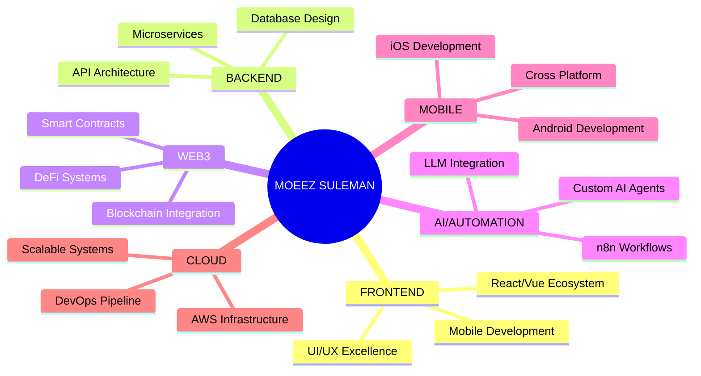

# <div align="center">:rocket: **Adil Fayyaz** :rocket:</div>
<div align="center">
  
</div>
<div align="center">
  
</div>
---
## <div align="center">:star2: **DIGITAL ARCHITECT & INNOVATION CATALYST** :star2:</div>
<div align="center">
  
</div>
```javascript
const moeezSuleman = {
  identity: ":dart: Elite Full-Stack Developer & Tech Visionary",
  location: ":earth_africa: Pakistan → Global Impact",
  mission: "Revolutionizing digital experiences through cutting-edge technology",
  specialization: {
    core: ["Web3 Ecosystems", "AI Agent Development", "Mobile Innovation"],
    advanced: ["Blockchain Architecture", "Automation Systems", "ML Integration"]
  },
  philosophy: "Code is poetry, innovation is art :art:",
  status: ":rocket: Constantly pushing technological boundaries"
};
```
---
## <div align="center">:zap: **TECHNOLOGICAL MASTERY** :zap:</div>
<div align="center">
  
</div>
### :dart: **FRONTEND EXCELLENCE**
<div align="center">
  
</div>
### :gear: **BACKEND MASTERY**
<div align="center">
  
</div>
### :link: **BLOCKCHAIN & WEB3**
<div align="center">
  
</div>
### :robot_face: **AI & AUTOMATION ARSENAL**
<div align="center">
  
</div>
### :iphone: **MOBILE INNOVATION**
<div align="center">
  
</div>
### :cloud: **CLOUD & DEVOPS**
<div align="center">
  
</div>
---
## <div align="center">:art: **INNOVATION SPECTRUM** :art:</div>
<div align="center">
| **:globe_with_meridians: FRONTEND** | **:gear: BACKEND** | **:link: BLOCKCHAIN** | **:robot_face: AI/ML** |
|:---:|:---:|:---:|:---:|
| React Ecosystem | Node.js Stack | Solidity Mastery | OpenAI Integration |
| Vue.js Framework | Python Backend | Smart Contracts | n8n Automation |
| Next.js SSR/SSG | Express APIs | Web3 Libraries | LangChain AI |
| TypeScript Pro | GraphQL APIs | DeFi Protocols | Hugging Face |
| SwiftUI Native | Flask/FastAPI | NFT Systems | TensorFlow |
| Jetpack Compose | Microservices | Hardhat Testing | Custom AI Agents |
| Flutter Cross | Database Design | MetaMask Integration | ML Pipeline |
| Animation Libraries | Real-time Systems | IPFS Storage | Voice Recognition |
</div>
---
## <div align="center">:hammer_and_wrench: **PROFESSIONAL TOOLKIT** :hammer_and_wrench:</div>
<div align="center">
  
</div>
---
## <div align="center">:dart: **SPECIALIZATION MATRIX** :dart:</div>
<div align="center">

</div>
---
## <div align="center">:star2: **SIGNATURE TECHNOLOGIES** :star2:</div>
<div align="center">
  <table>
    <tr>
      <td align="center" width="96">
        
        <br><strong>React</strong>
      </td>
      <td align="center" width="96">
        
        <br><strong>Vue.js</strong>
      </td>
      <td align="center" width="96">
        
        <br><strong>Next.js</strong>
      </td>
      <td align="center" width="96">
        
        <br><strong>Node.js</strong>
      </td>
      <td align="center" width="96">
        
        <br><strong>Python</strong>
      </td>
      <td align="center" width="96">
        
        <br><strong>Swift</strong>
      </td>
      <td align="center" width="96">
        
        <br><strong>Kotlin</strong>
      </td>
    </tr>
    <tr>
      <td align="center" width="96">
        
        <br><strong>Solidity</strong>
      </td>
      <td align="center" width="96">
        
        <br><strong>Flutter</strong>
      </td>
      <td align="center" width="96">
        
        <br><strong>AWS</strong>
      </td>
      <td align="center" width="96">
        
        <br><strong>Docker</strong>
      </td>
      <td align="center" width="96">
        
        <br><strong>MongoDB</strong>
      </td>
      <td align="center" width="96">
        
        <br><strong>PostgreSQL</strong>
      </td>
      <td align="center" width="96">
        
        <br><strong>n8n</strong>
      </td>
    </tr>
  </table>
</div>
---
## <div align="center">:performing_arts: **CONNECT WITH THE VISIONARY** :performing_arts:</div>
<div align="center">
  <a href="mailto:moeez.suleman460@gmail.com">
    
  </a>
  <a href="https://linkedin.com/in/moeez-suleman" target="_blank">
    
  </a>
  <a href="https://twitter.com/MoeezDev" target="_blank">
    
  </a>
  
</div>
---
## <div align="center">:dizzy: **INNOVATION PHILOSOPHY** :dizzy:</div>
<div align="center">
  
</div>
<div align="center">
  
</div>
---
<div align="center">
  <h2>:star2: "Architecting the Future, One Innovation at a Time" :star2:</h2>
  
</div>
<div align="center">
  <sub>:sparkles: Crafted with passion and precision by <strong>Moeez Suleman</strong> :sparkles:</sub>
</div>
